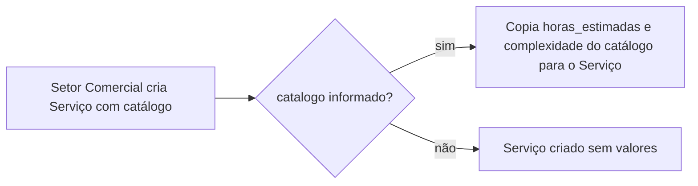

# Horas Estimadas, Prazos e Indicadores

## Objetivo

Este documento descreve as regras de negócio sobre estimativas de horas, complexidade, prazos e prioridades entre os apps `catalogo`, `ordens_servico` e `analise`.

O objetivo é permitir que o setor comercial cadastre uma Ordem de Serviço rapidamente, que o líder técnico refine as estimativas ao planejar a execução, e que o app `analise` calcule indicadores de prazo e produtividade a partir dessas informações.

---

## Estrutura Hierárquica

```txt
Ordem de Serviço
    └── Serviço da Ordem de Serviço  ── vinculado a um item do Catálogo
            └── Tarefa
```

`prazo` e `prioridade` existem de forma independente em cada nível (Ordem de Serviço, Serviço, Tarefa e Ordem de Serviço Operacional). Não há herança automática entre eles.

`horas_estimadas` e `complexidade` existem no Catálogo, no Serviço, na Tarefa e na Ordem de Serviço Operacional, e seguem a regra de cópia/herança descrita abaixo.

---

## Regra 1 - Prazo e Prioridade da Ordem de Serviço

`OrdemServico.prazo` e `OrdemServico.prioridade` são preenchidos manualmente pelo setor comercial no momento da criação da Ordem de Serviço.

Não há cálculo automático nem herança de outros níveis para esses campos.

---

## Regra 2 - Catálogo como Referência de Estimativa

Cada item de `Catalogo` (e `CatalogoOperacional`) mantém `horas_estimadas` e `complexidade` como valores de referência, cadastrados e mantidos pela gestão técnica.

Esses valores existem para serem reaproveitados automaticamente ao vincular um Serviço a um item de catálogo, evitando que o setor comercial precise conhecer detalhes técnicos de execução.

---

## Regra 3 - Cópia do Catálogo para o Serviço na Criação

Quando um Serviço é criado vinculado a um `catalogo`, o sistema copia `horas_estimadas` e `complexidade` do item de catálogo para os campos correspondentes do Serviço, caso esses campos não sejam enviados explicitamente na criação.



Implementado em `ServicoSerializer.create()` (`apps/ordens_servico/serializers/servico_serializer.py`).

### Regra 3.1 - Catálogo incompleto não bloqueia a criação

Se o item de catálogo não tiver `horas_estimadas` e/ou `complexidade` cadastrados, esses campos são copiados como `None` (nulos) para o Serviço.

A criação da Ordem de Serviço e do Serviço **nunca é bloqueada** pela ausência desses dados no catálogo. O preenchimento incompleto do catálogo apenas resulta em um Serviço sem estimativa até que o líder técnico o edite manualmente.

### Regra 3.2 - Valor copiado é fixo, não dinâmico

A cópia ocorre uma única vez, no momento da criação. Se o item de catálogo for alterado posteriormente, os Serviços já criados **não** acompanham a mudança — o valor gravado no Serviço é o que vale.

Isso é uma mudança em relação ao comportamento anterior, em que `horas_estimadas_efetivas`/`complexidade_efetiva` liam o catálogo dinamicamente sempre que o campo do Serviço estivesse vazio. As propriedades `*_efetiva(s)` continuam existindo como rede de segurança (por exemplo, para Serviços criados antes desta regra, ou casos em que o campo seja apagado manualmente), mas o caminho normal de criação já deixa o valor gravado.

---

## Regra 4 - Líder Técnico Pode Ajustar a Estimativa

Após a criação do Serviço, o líder técnico pode editar `horas_estimadas` e `complexidade` livremente, a seu critério, ao planejar a execução.

Não há permissão de backend restringindo essa edição a um papel específico — é uma convenção de processo, não uma regra técnica aplicada.

---

## Regra 5 - Horas Estimadas da Tarefa

Ao criar uma Tarefa, o responsável pela execução (líder técnico ou quem estiver atribuindo o trabalho) indica `horas_estimadas` própria da tarefa.

Não há validação que compare a soma das horas estimadas das tarefas de um Serviço com a `horas_estimadas` do Serviço — cada tarefa é independente.

---

## Regra 6 - Indicadores Calculados na Finalização

O app `analise` consome `prazo`, `prioridade`, `horas_estimadas` e as datas reais de execução (`data_inicio`, `data_termino`, `data_conclusao`) para calcular, quando Tarefas e Ordens de Serviço Operacionais são finalizadas:

* Taxa de cumprimento de prazo (`apps/analise/services/prazo.py`)
* Tempos médios de execução (`apps/analise/services/tempos.py`)
* Produtividade por técnico, incluindo horas estimadas entregues e itens atrasados (`apps/analise/services/produtividade.py`)

Não existe registro de horas reais trabalhadas no sistema — a comparação "estimado vs. real" é sempre entre horas estimadas e tempo decorrido em dias (datas reais).

---

## Regra 7 - Datas da Ordem de Serviço Operacional são Livres

Diferente do Serviço e da Tarefa (cujas `data_inicio`/`data_termino` são derivadas automaticamente da propagação de status — ver [Propagação de Status](./propagacao-de-status.md)), a Ordem de Serviço Operacional (OSO / "mini OS") não tem suas datas calculadas pelo sistema.

`data_recebimento`, `data_inicio` e `data_termino` são campos totalmente livres: podem ser preenchidos, deixados em branco ou editados manualmente a qualquer momento, independentemente do `status` da OSO.

Isso significa que:

* Mudar o `status` para `Em Andamento` ou `Finalizada` **não** preenche `data_inicio`/`data_termino` automaticamente.
* Mudar o `status` para fora de `Finalizada` **não** apaga `data_termino` automaticamente.
* É responsabilidade de quem registra a OSO manter essas datas coerentes com o `status`.

### Impacto nos indicadores

Os indicadores de `analise` que dependem de OSO (taxa de cumprimento de prazo, tempo médio por catálogo operacional, produtividade por técnico) só consideram uma OSO como concluída quando `status=Finalizada` **e** `data_termino` estiver preenchida. Como o preenchimento agora é manual, uma OSO finalizada sem `data_termino` informada simplesmente não entra nesses cálculos.

---

## Exemplo Completo

```txt
1. Setor comercial cria a Ordem de Serviço
   → define prazo e prioridade manualmente

2. Setor comercial cria o Serviço vinculado ao catálogo "Instalação X"
   → catálogo tem horas_estimadas=8h, complexidade=Média
   → Serviço é criado já com horas_estimadas=8h, complexidade=Média

3. Líder técnico revisa o Serviço
   → decide que a complexidade real é Alta e ajusta manualmente
   → horas_estimadas permanece 8h (não alterado)

4. Líder técnico cria as Tarefas de execução
   → Tarefa 1: horas_estimadas=3h
   → Tarefa 2: horas_estimadas=5h
   (soma não é validada contra o Serviço)

5. Tarefas são concluídas, com prazo e data_termino registrados

6. Indicadores de análise calculam cumprimento de prazo,
   tempo médio de execução e produtividade do técnico responsável
```

---

## Resultado Esperado

* O setor comercial não precisa conhecer detalhes técnicos para criar a Ordem de Serviço e o Serviço.
* O catálogo alimenta automaticamente a estimativa inicial do Serviço, sem travar a criação quando os dados estiverem incompletos.
* O líder técnico mantém controle total para ajustar a estimativa antes ou durante a execução.
* Os indicadores de prazo e produtividade refletem os dados definidos manualmente em cada nível da hierarquia.
