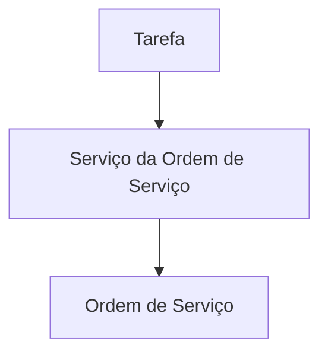
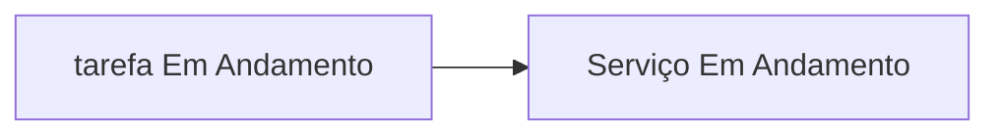
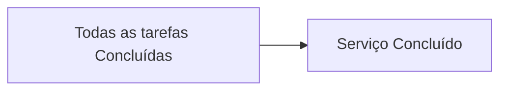
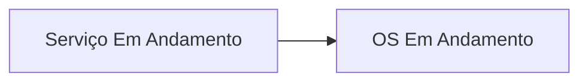
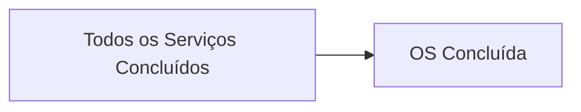

# Propagação de Status

## Objetivo

Este documento descreve as regras de propagação de status dentro da estrutura operacional do sistema.

A propagação de status tem como objetivo garantir que a situação real da execução seja refletida automaticamente nos níveis superiores da operação.

Dessa forma, gestores e usuários conseguem acompanhar o andamento das Ordens de Serviço sem a necessidade de atualizar múltiplos registros manualmente.

---

## Estrutura Hierárquica

A propagação de status ocorre seguindo a estrutura operacional da plataforma.

```txt
Ordem de Serviço
    └── Serviço da Ordem de Serviço
            └── Tarefa
```

A execução acontece no nível das tarefas.

Os serviços e a Ordem de Serviço refletem automaticamente o andamento das tarefas vinculadas.

---

## Fluxo de Propagação

A atualização dos status deve ocorrer de baixo para cima.



A tarefa representa a origem da informação.

O Serviço da Ordem de Serviço representa a consolidação da execução de suas tarefas.

A Ordem de Serviço representa a consolidação da execução de todos os seus serviços.

---

## Ciclo de Vida da Tarefa

Uma tarefa pode possuir os seguintes status:

```txt
Aberta
Em Andamento
Concluída
Cancelada
```

As tarefas são a unidade operacional básica do sistema.

Todas as alterações de status devem ser registradas na auditoria.

---

## Ciclo de Vida do Serviço da Ordem de Serviço

Um Serviço da Ordem de Serviço pode possuir os seguintes status:

```txt
Aberto
Em Andamento
Concluído
Cancelado
```

O status do serviço deve ser calculado com base nas tarefas associadas.

---

## Ciclo de Vida da Ordem de Serviço

Uma Ordem de Serviço pode possuir os seguintes status:

```txt
Aberta
Em Andamento
Concluída
Cancelada
```

O status da Ordem de Serviço deve ser calculado com base nos status dos seus serviços.

---

## Regra 1 - Início da Execução

Quando a primeira tarefa de um Serviço da Ordem de Serviço for colocada em andamento, o Serviço da Ordem de Serviço deve passar automaticamente para:

```txt
Em Andamento
```

Fluxo:



---

## Regra 2 - Conclusão do Serviço

Quando todas as tarefas de um Serviço da Ordem de Serviço estiverem concluídas, o serviço deve passar automaticamente para:

```txt
Concluído
```

Fluxo:



Enquanto existir ao menos uma tarefa não concluída, o serviço não poderá ser considerado concluído.

---

## Regra 3 - Ordem de Serviço em Andamento

Quando pelo menos um Serviço da Ordem de Serviço estiver em andamento, a Ordem de Serviço deve passar automaticamente para:

```txt
Em Andamento
```

Fluxo:



---

## Regra 4 - Conclusão da Ordem de Serviço

Quando todos os Serviços da Ordem de Serviço estiverem concluídos, a Ordem de Serviço deve passar automaticamente para:

```txt
Concluída
```

Fluxo:



---

## Regra 5 - Cancelamento

O cancelamento de uma Ordem de Serviço não deve ocorrer automaticamente por propagação de status.

O cancelamento deve ser uma ação explícita realizada por usuários autorizados.

Da mesma forma:

* O cancelamento de uma tarefa não cancela automaticamente um serviço.
* O cancelamento de um serviço não cancela automaticamente uma Ordem de Serviço.

As regras de cancelamento devem ser tratadas individualmente.

---

## Auditoria

Toda alteração automática de status deve gerar registros de auditoria.

Exemplos:

* Serviço alterado para Em Andamento
* Serviço alterado para Concluído
* Ordem de Serviço alterada para Em Andamento
* Ordem de Serviço alterada para Concluída

Cada evento deve registrar:

* Data e hora
* Usuário responsável pela ação que originou a alteração
* Status anterior
* Status atual
* Motivo da alteração

---

## Exemplo Completo

```txt
OS #001

├── Serviço A
│   ├── tarefa 1
│   ├── tarefa 2
│   └── tarefa 3
│
└── Serviço B
    ├── tarefa 1
    └── tarefa 2
```

Cenário:

```txt
tarefa 1 do Serviço A
↓
Em Andamento

Resultado:
Serviço A → Em Andamento
OS → Em Andamento
```

Posteriormente:

```txt
Todas as tarefas do Serviço A
↓
Concluídas

Resultado:
Serviço A → Concluído
```

Por fim:

```txt
Todos os serviços da OS
↓
Concluídos

Resultado:
OS → Concluída
```

---

## Resultado Esperado

A propagação automática de status deve garantir que:

* O status da Ordem de Serviço represente a situação real da execução.
* O status dos serviços represente a situação real das tarefas.
* Não seja necessário atualizar manualmente múltiplos níveis da estrutura operacional.
* Gestores consigam acompanhar a operação através dos status consolidados.
* O histórico de auditoria reflita todas as alterações relevantes ocorridas durante a execução.
